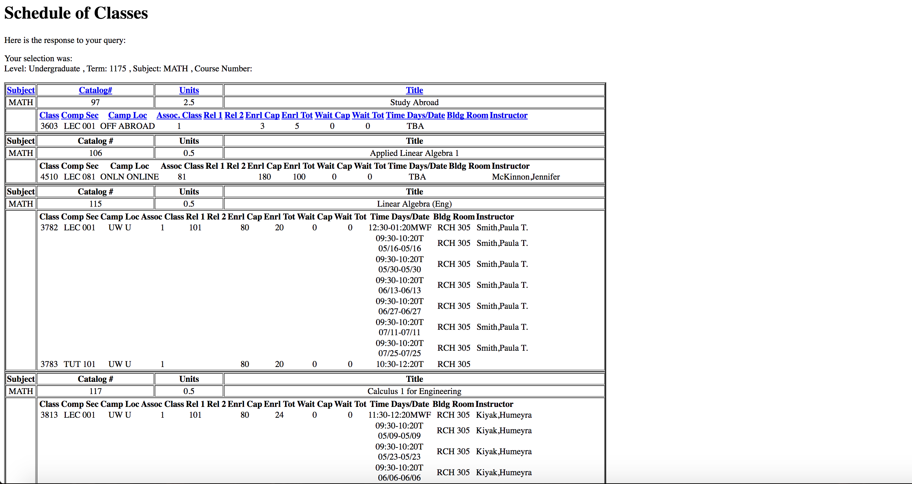
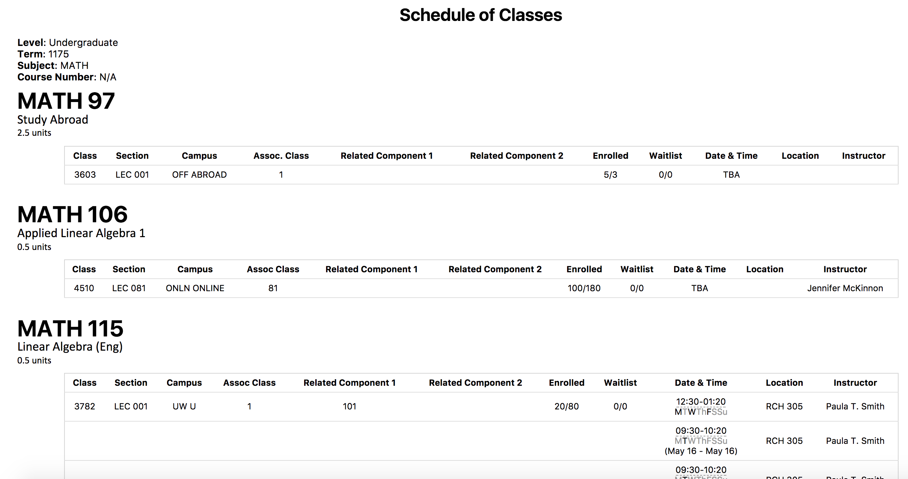

# Pretty UW Course Schedule
An improvement to viewing University of Waterloo *Schedule of Classes* pages.

## Features
* CSS styling to fonts and tables
* Each course result has its own separate table and heading (eliminates nested tables)
* Togglable table rows to show/hide course reserves
* Combined table columns for enrolment and waitlist numbers
* Dates and times rendered nicely

## Comparison

The default course schedule pages have no styling and are very ugly and cluttered. See the following comparison:
| Disabled  | Enabled |
|---|---|
|   |   |

## Installation

1. Download `pretty_uw_course_schedule.crx` file from [Releases](https://github.com/JeffreyCA/PrettyUWCourseSchedule/releases).
2. In Chrome, go to [Extensions](chrome://extensions/).
3. Drag `pretty_uw_course_schedule.crx` into window.
4. Click **Add Extension**.

## Credits
* `datejs` and `jQuery` libraries
* [UWFlow.com](https://uwflow.com) for inspiration
