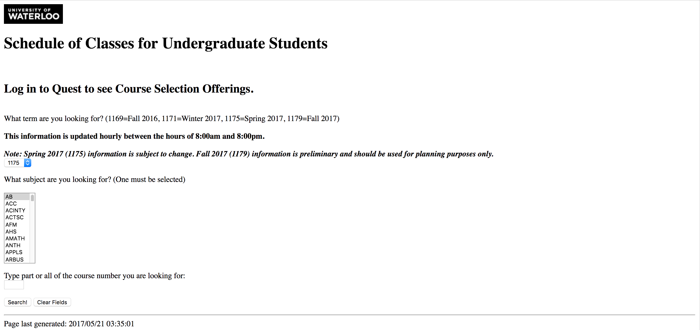
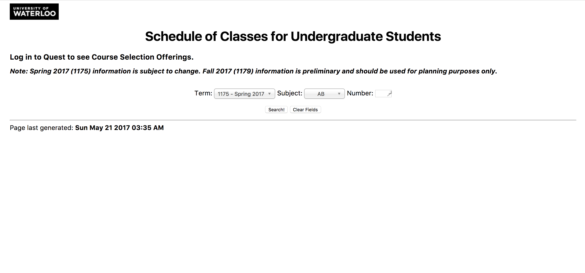
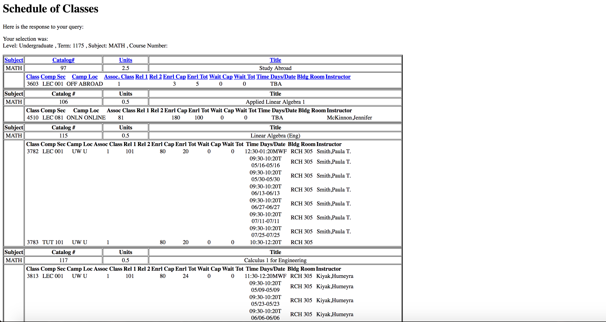
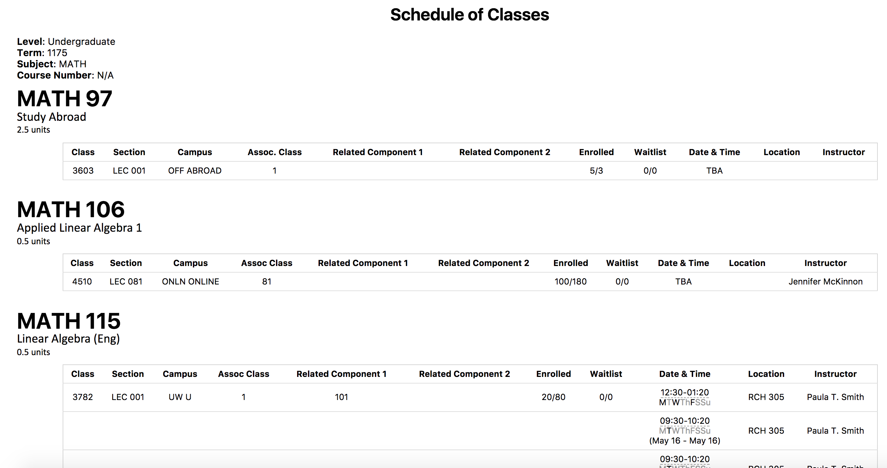

# Pretty UW Course Schedule
An improvement to viewing University of Waterloo *Schedule of Classes* pages.

## Features
* Restructured [course search form](http://www.adm.uwaterloo.ca/infocour/CIR/SA/under.html)
    * Input boxes support keyword filtering (type subject names instead of scrolling through long list)
    * View course information from up to 6 terms ago + next term.
* Press extension icon to toggle styling
* CSS styling to fonts and tables
* Each course result has its own separate table and heading (eliminate nested tables)
* Clickable table rows to show/hide course reserves
* Combined table columns for enrolment and waitlist numbers
* Other QoL improvements

## Comparison
### Searching Courses
Disabled  | Enabled
:--------:|:--------:
 | 

### Viewing Courses
Disabled  | Enabled
:--------:|:--------:
 | 

## [Installation](https://chrome.google.com/webstore/detail/pretty-uw-course-schedule/gilgimlfokldlkkejocbdefeoipphcpc)

## Usage
* Access [**Schedule of Classes**](http://www.adm.uwaterloo.ca/infocour/CIR/SA/under.html) page
* Or go to direct query result
    * Example: `https://info.uwaterloo.ca/cgi-bin/cgiwrap/infocour/salook.pl?sess=1175&level=under&subject=MATH&cournum=135`

## Credits
#### Libraries
* [Chosen](https://harvesthq.github.io/chosen/)
* [datejs](http://www.datejs.com/)
* [jQuery](https://jquery.com/)
#### Other
* [UWFlow](https://uwflow.com) for inspiration
